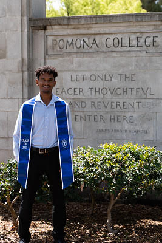

{: .center }

I'm a first-year PhD student in Computer Science at Purdue University. My research focuses on Natural Language Processing (NLP), with a particular interest in large language models and understand social phenomena.

## Education
- **PhD in Computer Science** (Ongoing)
  - Purdue University
- **B.A in Comptuter Science**, Mathematics
  - Pomona College, class of 2023

## Research Interests
- Natural Language Processing (NLP)
- Theory of Mind in Large Language Models
- Mechanistic Interpretability
- Fake News Classification

## Current Projects
### Fake News Classification
I am currently working on leveraging Large Language Models to help with fake news detection. Specifically, I'd like to use the internet to inform predictions. Large Language Models have great internal knowledge and are good for synthesizing internet results that contain a lot of information, but they still have their pitfalls. I created an evidence based classification model and submitted it to the AVeriTeC shared task, a fake news classification dataset published for the [FEVER](fever.ai) workshop. Unfortunately, since I completed this project myself without support, my limited compute and disk space hampered my ability to use more powerful models, but I came up with a theoretical framework I'd like to explore more in the future.

## Contact
- **Email:** ngetach [AT] purdue [DOT] edu
- **LinkedIn:** [linkedin.com/in/nathanielgetachew](https://www.linkedin.com/in/nathaniel-getachew-6a59b0201/)
- **GitHub:** [github.com/ngetachew](https://github.com/ngetachew)

## Hobbies and Interests

Outside of my academic pursuits, I enjoy running and playing guitar. I was formerly on the Pomona Pitzer Cross Country and Track teams, and I'm currently finishing up my NCAA career on the Purdue Track Team. Chirp Chirp, and Boiler Up!

Feel free to reach out if you want to discuss research, collaboration, or just have a chat!
