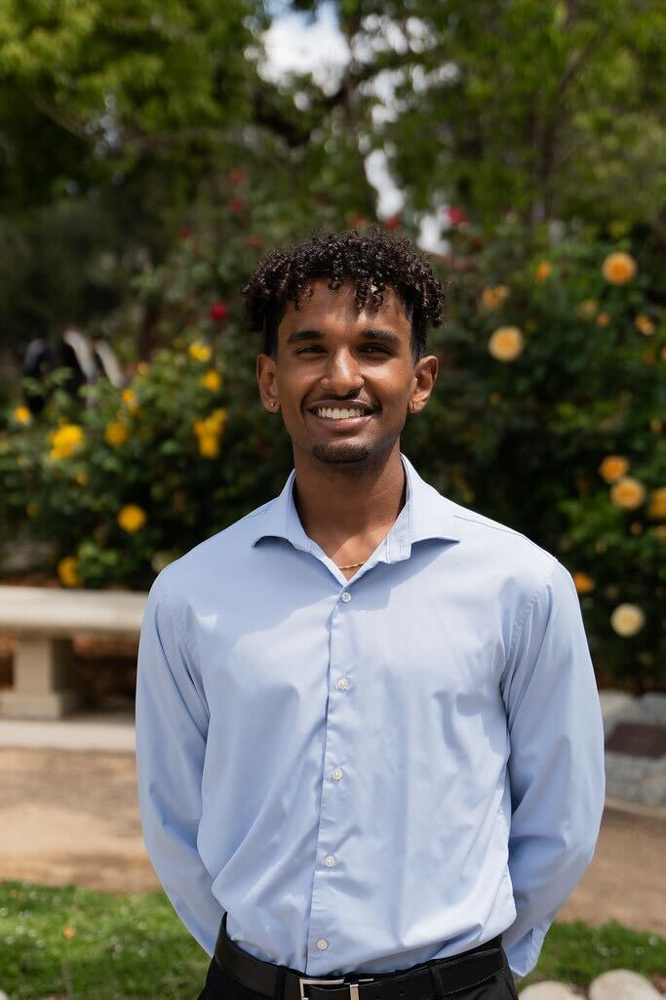

I'm a third-year PhD student in Computer Science at Purdue University advised by [Dr. Abulhair Saparov](https://asaparov.org/) . I'm interested in projects broadly related to the world modeling abilities of LLMs. This is something you typically see studied in game-like environments, but I'd like to see what happens when you shift this paradigm to other domains. I intend to explore this in social reasoning and document understanding problems. Read more about my thoughts for future research [here](https://docs.google.com/document/d/15tK-3hWZ2lWw1V8QhgLj3hCDctYWcn2isyNlBGyvdRg/edit?tab=t.0#heading=h.rs0shqmwd2am). 

## Education
- **Purdue University**, PhD in Computer Science *(2023 - Present)*
- **Pomona College**, B.A in Comptuter Science & Mathematics *(2019-2023)*

## Publications:

- [Language Models Might Not Understand You: Evaluating Theory of Mind via Story Prompting](https://arxiv.org/pdf/2506.19089)

  Nathaniel Getachew, Abulhair Saparov

  *Social Simulation with LLMs Workshop @ COLM 2025*
  [Spotlight Award](https://sites.google.com/view/social-sims-with-llms), [Oral Presentation](https://www.youtube.com/watch?v=W4O6pMfTYOg)

- *Undergraduate Thesis:* [Latent Dirichlet Allocation: Topic Modeling and Automatically Ranking Topics](https://github.com/ngetachew/Getachew-Thesis-2023/blob/main/Getachew_Thesis.pdf)

  Advised by Dr. Gabrial Chandler

## Contact
- **Email:** ngetach [AT] purdue [DOT] edu
- **LinkedIn:** [linkedin.com/in/nathanielgetachew](https://www.linkedin.com/in/nathaniel-getachew-6a59b0201/)
- **GitHub:** [github.com/ngetachew](https://github.com/ngetachew)

## Hobbies and Interests

Outside of my academic pursuits, I enjoy running and playing guitar. I ran for the Pomona Pitzer and Purdue Track & Cross Country Teams. Chirp Chirp, and Boiler Up!

Feel free to reach out if you want to discuss research, collaboration, or just have a chat!
